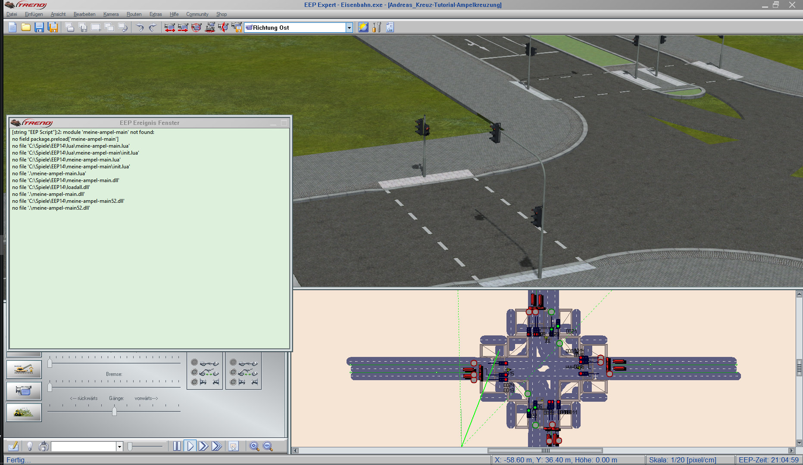
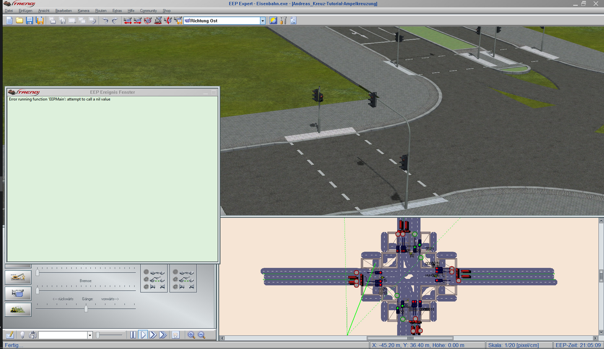
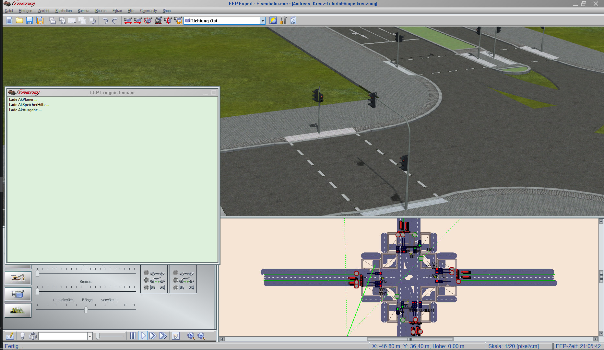
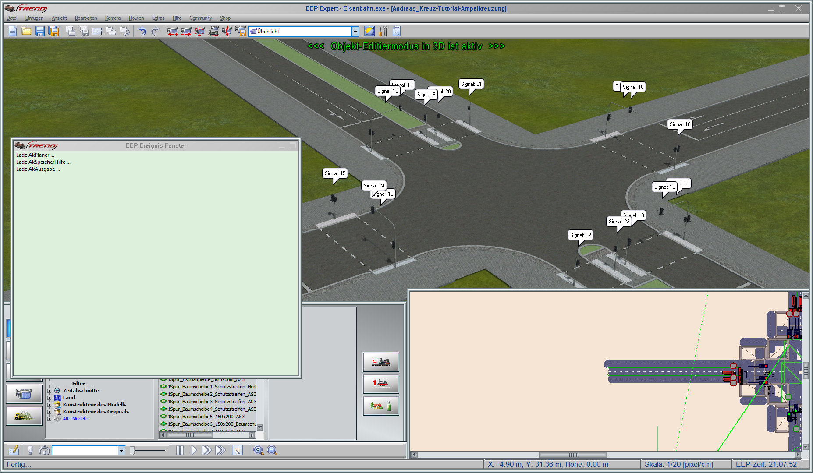
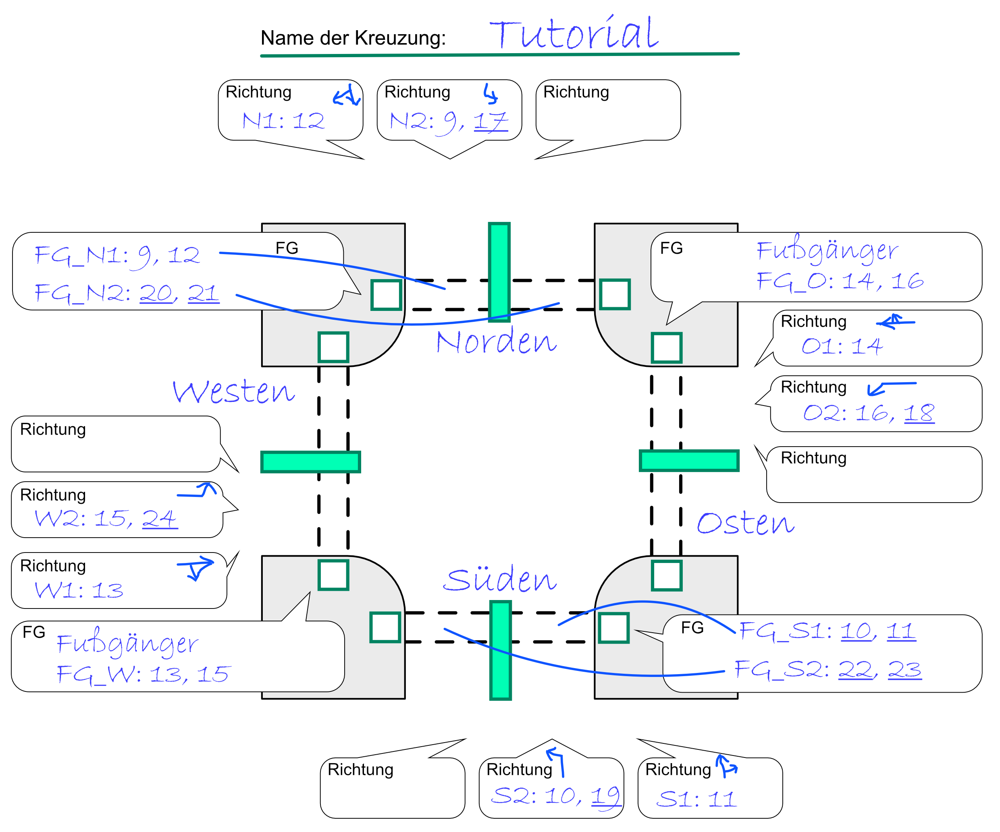
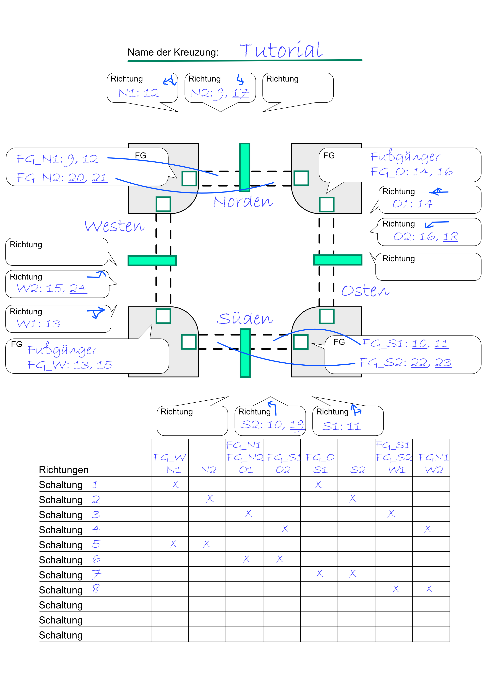
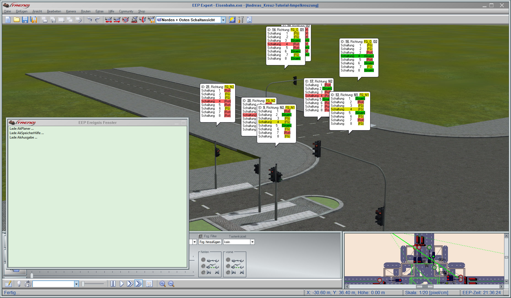
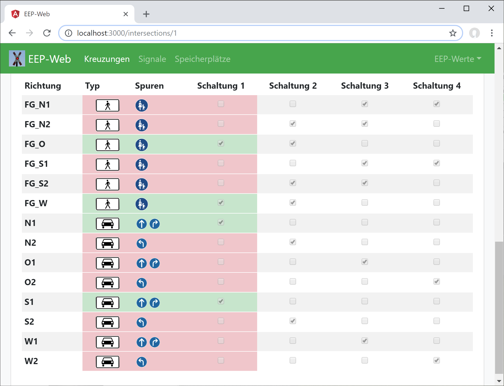

# Ampelkreuzung automatisch steuern

<p class="lead"> Diese Anleitung zeigt Dir, wie Du in EEP eine mit Ampeln versehene Kreuzung mit der Lua-Bibliothek verdrahten kannst.</p>

<hr>

Dafür benötigst Du folgendes:

- **EEP 14** und einen **Editor für Lua-Skripte** Deiner Wahl, z.B. Notepad++
- **Zettel und Stift** - z.B.: [_Kreuzungsaufbau.pdf_](../../assets/Kreuzungsaufbau.pdf)
- Die **Anlage Andreas_Kreuz-Tutorial-Ampelkreuzung.anl3** (Download auf der Startseite)
  <br>Für den Betrieb dieser Anlage brauchst Du folgende **Modelle**:

  | 1Spur-Großstadtstraßen-System-Grundset (V10NAS30002) | _[Download](https://eepshopping.de/1spur-gro%C3%83%C6%92%C3%82%C5%B8stadtstra%C3%83%C6%92%C3%82%C5%B8en-system-grundset%7C7656.html)_ |
  | 1Spur-Ergänzungsset | _[Download](https://www.eepforum.de/filebase/file/215-freeset-zu-meinem-1spur-strassensystem/)_ |
  | Ampel-Baukasten für mehrspurige Straßenkreuzungen (V80NJS20039) | _[Download](https://eepshopping.de/ampel-baukasten-f%C3%83%C6%92%C3%82%C2%BCr-mehrspurige-stra%C3%83%C6%92%C3%82%C5%B8enkreuzungen%7C6624.html)_ |
  | Straßenbahnsignale als Immobilien (V80MA1F010 und V10MA1F011) | _[Download](http://www.eep.euma.de/download.php)_ |

⭐ **_Tipp_**: Die Lua-Bibliothek ist in der Installation der Anlage enthalten. Möchtest Du Deine eigene Anlage verwenden, so kannst Du die Bibliothek wie folgt installieren: [_Installation der Control Extension_](../anleitungen-installation/installation)

# Los geht's

- Öffne die Anlage in EEP
- Öffne Deinen Editor für Lua-Skripte

## Das Lua-Haupt-Skript anlegen

⭐ _**Tipp:** Aktiviere in EEP unter Programmeinstellungen das EEP Ereignisfenster, damit Du die Lua Meldungen lesen kannst._

❗ _**Beachte:** Diese Anleitung geht davon aus, dass in der geöffneten Anlage noch nichts mit LUA gemacht wurde. Verwendest Du Dein eigenes Anlagen-Skript, dann lösche es nicht, sondern ergänze es um die weiter unten aufgeführten Befehle._

<br>

- Das Haupt-Skript `meine-ampel-main.lua` wirst Du im nächsten Schritt im LUA-Verzeichnis von EEP anlegen: `C:\Trend\EEP14\LUA`

- Öffne den LUA-Editor in EEP, wähle alles mit `<Strg>` + `<A>` aus und ersetze es durch

  ```lua
  clearlog()
  require("meine-ampel-main")
  ```

- Klicke in EEP auf _"Skript neu laden"_ und wechsle in den 3D-Modus. <br>😀 **Wenn Du alles richtig gemacht hast**, erscheint im Log eine Fehlermeldung, dass `meine-ampel-main.lua` nicht gefunden werden kann.

  

<br>

- Lege nun das Haupt-Skript an `C:\Trend\EEP14\LUA\meine-ampel-main.lua` im Verzeichnis `LUA` an

  Dies wird das Skript werden, welches in der Anlage verwendet wird. Egal, wie Deine Anlage heißt.

- Klicke in EEP auf _"Skript neu laden"_ und wechsle in den 3D-Modus. <br>😀 **Wenn Du alles richtig gemacht hast**, erscheint eine Fehlermeldung, dass `meine-ampel-main.lua` nicht gefunden werden kann.

  

## Notwendige Befehle in das Lua-Skript aufnehmen

- Ergänze das Lua-Haupt-Skript um die folgenden Zeilen.

  ```lua
  local Scheduler = require("ce.hub.scheduler.Scheduler")
  local TrafficLight = require("ce.mods.road.TrafficLight")
  local TrafficLightModel = require("ce.mods.road.TrafficLightModel")
  local Crossing = require("ce.mods.road.Crossing")
  local CrossingSequence = require("ce.mods.road.CrossingSequence")
  local Lane = require("ce.mods.road.Lane")

  -- Hier kommt der Code

  local ControlExtension = require("ce.ControlExtension")
  ControlExtension.addModules(
      require("ce.hub.mods.CoreCeModule"),
      require("ce.mods.road.RoadCeModule")
  )

  function EEPMain()
      ControlExtension.runTasks()
      return 1
  end
  ```

- Klicke in EEP auf _"Skript neu laden"_ und wechsle in den 3D-Modus. <br>😀 **Wenn Du alles richtig gemacht hast**, verschwindet die Fehlermeldung

  

**Was ist grade passiert?**

- Die ersten Zeilen `local XXX = require("ce.mods.road.XXX")` sorgt dafür, daß die einzelnen Dateien z.B. `ce/mods/road/Crossing.lua` einmal eingelesen wird. Nach diesem Aufruf stehen Dir alle Funktionen dieser Datei zur Verfügung.
- Die Zeile `local ControlExtension = require("ce.ControlExtension")` lädt den öffentlichen Einstiegspunkt der Bibliothek.
- Mit den Zeilen `ControlExtension.addModules(require("ce.hub.mods.CoreCeModule"), require("ce.mods.road.RoadCeModule"))` werden das "CoreCeModule" und das "RoadCeModule" in der Anwendung bekannt gemacht.
- Die Zeile `ControlExtension.runTasks()` ist für das wiederkehrende Ausführen aller Aufgaben, dadurch werden die Kreuzungsschaltungen und die geplanten Aktionen durchgeführt.
- Wichtig ist auch, dass die Funktion EEPMain mit `return 1` beendet wird, damit sie alle 200 ms aufgerufen wird.

## Alle Signale mit Tipp-Text markieren

Um die Signale (in dem Fall Ampeln) der Kreuzung zu bearbeiten ist es am einfachsten, wenn Du die Signal-IDs aller Signale in Tipp-Texten anzeigst.
In diesem Schritt läßt Du Dir von `Crossing` alle Signal-IDs in 3D anzeigen.

❗ _**Beachte:** Verwende diesen Code nicht, wenn Du in Deiner Anlagen selbst Tipp-Texte mit `EEPShowSignalInfo(...)` an Deinen Signalen anzeigst. Denn all diese Tipp-Texte werden gelöscht._

- Um die Tipp-Texte anzuzeigen, füge die folgenden beiden Zeilen vor der EEPMain()-Methode hinzu:

  ```lua
  -- Hier kommt der Code
  CrossingSetting.showSignalIdOnSignal = true
  CrossingSetting.showSequenceOnSignal = true
  ```

- Klicke in EEP auf _"Skript neu laden"_ und wechsle in den 3D-Modus. <br>😀 **Wenn Du alles richtig gemacht hast**, siehst Du an allen Signalen Tipp-Texte mit den IDs dieser Signale.

  

**Was ist grade passiert?**

- Das neu Laden der Anlage hat dafür gesorgt, dass das Skript `Crossing` anhand der Variablen erkannt hat, dass es für alle Signale von 1 bis 1000 deren Signal-ID als Tipp-Text einblenden soll.

## Die Fahrspuren und Signal-IDs der Kreuzung notieren

_**Tipp:** Das [PDF-Dokument Kreuzungsaufbau.pdf](../../assets/Kreuzungsaufbau.pdf) hilft Dir deine Kreuzung zu notieren._

Notiere Dir, welche _Fahrspuren_ es gibt und wie die IDs der zu schaltenden Ampeln heißen - merke Dir dabei, welche unterschiedlichen Ampelmodelle eingesetzt werden.

**Wichtige Unterscheidung dabei:** Welche Ampeln steuern den Verkehr direkt (das sind die Fahrspur-Ampeln) und welche Ampeln müssen neben den Fahrspur-Ampeln noch in der Schaltung berücksichtigt werden.

In der Beispielanlage sind es:

- Kombinierte Fußgänger- und Strassenverkehrsampeln
- Reine Fußgängerampeln _(die sind in der Skizze bei "FG" unterstrichen)_
- Strassenverkehrsampeln _(die sind in der Skizze bei "Fahrspur" unterstrichen)_



**Was ist eine _Fahrspur_**: In diesem Abschnitt wird viel von _Fahrspuren_ geredet. Eine _Fahrspur_ besteht aus Straßen-Splines, auf denen mehrere Fahrzeuge hintereinander an einer Ampel anstehen.

- **Jede Fahrspur hat genaue eine Fahrspur-Ampel.** Dies ist die einzige Ampel, die auf der Straße der Fahrspur stehen darf.
  Die Fahrspur-Ampel läßt Fahrzeuge der Fahrspur anhalten oder fahren.

- **Nur die Fahrspur-Ampel steuert Fahrzeuge.** Nur die Ampel auf der Fahrspur darf die Fahrzeuge durch das Ampelbild steuern.
  Du kannst aber weitere Ampeln für Fahrzeuge aufstellen, z.B. eine zweite Ampel auf der linken Straßenseite oder ein dritte über dem Verkehr. Nur die Fahrspur-Ampel darf den Verkehr auf der Straße steuern - alle anderen Ampeln müssen so aufgestellt werden, dass sie den Verkehr nicht beeinflussen.

- **Fahrspuren werden nicht geschaltet, sondern Ampeln.** Jede Schaltung der Kreuzung schaltet bestimmte Ampeln auf grün. Dabei wird auch die Fahrspur-Ampel gesteuert.

  - Im einfachen Fall wird die Fahrspur-Ampel direkt in der Schaltung gesteuert
  - Später werden wir Szenarien haben, in denen die Fahrspur-Ampel unsichtbar ist, da mehrere andere Ampeln für die Fahrspur gelten. Der Verkehr wird dann abhängig von den anderen Ampeln gesteuert.

- **Empfehlung: Erstelle immer eigene Fahrspuren für Linksabbieger, wenn diese den Gegenverkehr kreuzen**.
  Wenn Du dich nicht selbst darum kümmern willst, dass Fahrzeuge den Gegenverkehr beachten, dann solltest Du immer eigene Linksabbieger-Fahrspuren anlegen. Schalte Linksabbieger-Fahrspuren nur dann auf grün, wenn der Gegenverkehr den Fahrweg der Linksabbieger nicht kreuzen kann.
  - **Alternative:** Du kannst auch eigene unsichtbaren Ampeln in der Mitte der Kreuzung einbauen und die Linkabbieder nur dann fahren lassen, wenn kein Gegenverkehr kommt. Dies musst Du jedoch selbst machen.

Erst im nächsten Schritt werden mehrere Ampeln der _Fahrspuren_ in Schaltungen zusammengefasst.

## Schreibe die Ampeln und Fahrspuren in das Haupt-Skript

⭐ _**Tipp:** In EEP sind viele Signalmodelle "Ampel" unterschiedlich gesteuert, was die Rot-, Grün- und Gelb-Schaltung angeht. Damit jede Ampel Deiner Kreuzung verwendet werden kann und automatisch funktioniert, gibt es_ `TrafficLightModel` _. In diesem Lua-Skript sind die Signalstellungen der Ampeln hinterlegt. Weitere Informationen findest Du unter: [Unterstütze weitere Ampeln in TrafficLightModel](../lua/ce/mods/road/)_

Schreibe nun die Ampeln in das Haupt-Skript.

```lua
local K1 = TrafficLight:new("K1", 12, TrafficLightModel.JS2_3er_mit_FG)
local K2 = TrafficLight:new("K2", 17, TrafficLightModel.JS2_3er_ohne_FG)
local K3 = TrafficLight:new("K3", 9, TrafficLightModel.JS2_3er_mit_FG)
local K4 = TrafficLight:new("K4", 14, TrafficLightModel.JS2_3er_mit_FG)
local K5 = TrafficLight:new("K5", 16, TrafficLightModel.JS2_3er_mit_FG)
local K6 = TrafficLight:new("K6", 18, TrafficLightModel.JS2_3er_ohne_FG)
local K7 = TrafficLight:new("K7", 11, TrafficLightModel.JS2_3er_mit_FG)
local K8 = TrafficLight:new("K8", 10, TrafficLightModel.JS2_3er_mit_FG)
local K9 = TrafficLight:new("K9", 19, TrafficLightModel.JS2_3er_ohne_FG)
local K10 = TrafficLight:new("K10", 13, TrafficLightModel.JS2_3er_mit_FG)
local K11 = TrafficLight:new("K11", 15, TrafficLightModel.JS2_3er_mit_FG)
local K12 = TrafficLight:new("K12", 24, TrafficLightModel.JS2_3er_ohne_FG)

local F1 = K1 -- K1 wird später auch als Fussgaenger-Ampel F1 verwendet
local F2 = K3 -- K3 wird später auch als Fussgaenger-Ampel F2 verwendet
local F3 = TrafficLight:new("F3", 20, TrafficLightModel.JS2_2er_nur_FG)
local F4 = TrafficLight:new("F4", 21, TrafficLightModel.JS2_2er_nur_FG)
local F5 = K4
local F6 = K5
local F7 = K7
local F8 = K8
local F9 = TrafficLight:new("F9", 22, TrafficLightModel.JS2_2er_nur_FG)
local F10 = TrafficLight:new("F10", 23, TrafficLightModel.JS2_2er_nur_FG)
local F11 = K10
local F12 = K11
```

Schreibe danach die Fahrspuren in das Skript:

```lua
-------------------------------------------------------------------------------
-- Definiere die Fahrspuren fuer die Kreuzung
-------------------------------------------------------------------------------

--   +---------------------------------------------- Neue Fahrspur
--   |        +------------------------------- Name der Fahrspur
--   |        |     +------------------------- Speicher ID - um die Anzahl der Fahrzeuge
--   |        |     |                                        und die Wartezeit zu speichern
--   |        |     |      +------------------ Fahrspur-Ampel - da wartet der Verkehr
--   |        |     |      |  +--------------- Richtungen dieser Fahrspur
n1 = Lane:new("N1", 100, K1, {'STRAIGHT', 'RIGHT'})
n2 = Lane:new("N2", 101, K3, {'LEFT'}) -- zusätzlich in der Schaltung: K2

-- Fahrspuren im Osten
o1 = Lane:new("O1", 104, K4, {'STRAIGHT', 'RIGHT'})
o2 = Lane:new("O2", 105, K6, {'LEFT'}) -- zusätzlich in der Schaltung: K5

-- Fahrspuren im Sueden
s1 = Lane:new("S1", 107, K7, {'STRAIGHT', 'RIGHT'})
s2 = Lane:new("S2", 108, K8, {"LEFT"}) -- zusätzlich in der Schaltung: K9

-- Fahrspuren im Westen
w1 = Lane:new("W1", 111, K10, {'STRAIGHT', 'RIGHT'})
w2 = Lane:new("W2", 112, K12, {'LEFT'}) -- zusätzlich in der Schaltung: K11
```

- Klicke in EEP auf _"Skript neu laden"_ und wechsle in den 3D-Modus. <br> 😀 **Wenn Du alles richtig gemacht hast**, siehst Du weiterhin an allen Signalen Tipp-Texte mit den IDs dieser Signale und keine Fehlermeldung im Log.

**Was ist grade passiert?**

- Du hast soeben die Ampeln `TrafficLight` und die Fahrspuren `Lane` der Kreuzung festgelegt. Jede kann für sich allein geschaltet werden oder zusammen mit anderen Fahrspuren. Die Zusammenfassung der Schaltung kommt im nächsten Schritt: `CrossingSequence`.

## Schalte die Ampeln nun zu Schaltungen zusammen

Eine _Schaltung_ `CrossingSequence` legt fest, welche _Ampeln_ `TrafficLight` gleichzeitig "grün" bekommen sollen. An einer Kreuzung ist immer nur eine Schaltung aktiv.

Das macht die Automatik dann für Dich: Bevor eine neue Schaltung ihre die Ampeln auf "grün" schaltet, werden erst alle Ampeln der vorherigen Schaltung auf rot geschaltet - wenn sie nicht mehr in der neuen Schaltung enthalten sind.

❗ _**Beachte**: Eine **Schaltung** darf **Ampeln** nur so schalten, dass sich die Fahrzeuge der Fahrspuren überlappungsfrei fahren können._

Notiere Dir nun, welche der _Ampeln_ zu _Schaltungen_ zusammengefasst werden sollen.



⭐ _**Tipp**: Wichtig ist, das jeder Fahrspur in mindestens einer Schaltung berücksichtigt wird.
Im Beispiel siehst Du, dass Fahrspuren in mehreren Schaltungen enthalten sein können.
Es würde jedoch genügen, entweder die Schaltungen 1 bis 4 oder die Schaltungen 5 bis 8 zu verwenden, da in diesen jeweils alle Fahrspuren enthalten sind._

## Schreibe die Schaltungen in das Haupt-Skript

```lua
--------------------------------------------------------------
-- Definiere die Schaltungen und die Kreuzung
--------------------------------------------------------------
-- Eine Schaltung bestimmt, welche Fahrspuren gleichzeitig auf
-- grün geschaltet werden dürfen, alle anderen sind rot

--- Tutorial 1: Schaltung 1
local sch1 = CrossingSequence:new("Schaltung 1")
sch1:addCarLights(K1)
sch1:addCarLights(K7)
sch1:addPedestrianLights(F5, F6)
sch1:addPedestrianLights(F11, F12)

--- Tutorial 1: Schaltung 2
local sch2 = CrossingSequence:new("Schaltung 2")
sch2:addCarLights(K2, K3)
sch2:addCarLights(K8, K9)
sch2:addPedestrianLights(F3, F4)
sch2:addPedestrianLights(F5, F6)
sch2:addPedestrianLights(F11, F12)
sch2:addPedestrianLights(F9, F10)

--- Tutorial 1: Schaltung 3
local sch3 = CrossingSequence:new("Schaltung 3")
sch3:addCarLights(K4)
sch3:addCarLights(K10)
sch3:addPedestrianLights(F1, F2)
sch3:addPedestrianLights(F3, F4)
sch3:addPedestrianLights(F7, F8)
sch3:addPedestrianLights(F9, F10)

--- Tutorial 1: Schaltung 4
local sch4 = CrossingSequence:new("Schaltung 4")
sch4:addCarLights(K5, K6)
sch4:addCarLights(K11, K12)
sch4:addPedestrianLights(F1, F2)
sch4:addPedestrianLights(F7, F8)

-- --- Tutorial 1: Schaltung 5
-- local sch5 = CrossingSequence:new("Schaltung 5")
-- sch5:addCarLights(K1)
-- sch5:addCarLights(K2, K3)
-- sch5:addPedestrianLights(F11, F12)
--
-- --- Tutorial 1: Schaltung 6
-- local sch6 = CrossingSequence:new("Schaltung 6")
-- sch6:addCarLights(K4)
-- sch6:addCarLights(K5, K6)
-- sch6:addPedestrianLights(F1, F2)
-- sch6:addPedestrianLights(F3, F4)
-- sch6:addPedestrianLights(F7, F8)
--
-- --- Tutorial 1: Schaltung 7
-- local sch7 = CrossingSequence:new("Schaltung 7")
-- sch7:addCarLights(K7)
-- sch7:addCarLights(K8, K9)
-- sch7:addPedestrianLights(F5, F6)
--
-- --- Tutorial 1: Schaltung 6
-- local sch8 = CrossingSequence:new("Schaltung 8")
-- sch8:addCarLights(K4)
-- sch8:addCarLights(K5, K6)
-- sch8:addPedestrianLights(F1, F2)
-- sch8:addPedestrianLights(F7, F8)
-- sch8:addPedestrianLights(F9, F10)

k1 = Crossing:new("Tutorial 1")
-- k1:setSwitchInStrictOrder(true)
k1:addSequence(sch1)
k1:addSequence(sch2)
k1:addSequence(sch3)
k1:addSequence(sch4)
-- k1:addSequence(sch5)
-- k1:addSequence(sch6)
-- k1:addSequence(sch7)
-- k1:addSequence(sch8)
```

- Klicke in EEP auf _"Skript neu laden"_ und wechsle in den 3D-Modus. <br>😀 **Wenn Du alles richtig gemacht hast**, siehst Du plötzlich, dass die Schaltungen zum Leben erwachen.

  

**Was ist grade passiert?**

- Du hast soeben die Fahrspuren zu Schaltungen zusammengefasst und diese einer Kreuzung zugewiesen. Durch die beiden am Anfang hinzugefügten Aufrufe in EEPMain() plant die Kreuzung automatisch ihre Schaltungen der Planer führt sie aus.

## Schalte die Hilfsfunktionen wieder aus

Erinnerst Du Dich den Code, der die Tipp-Texte zu den Signalen hinzugefügt hat?

- Wenn Du möchtest, kannst Du die Tipp-Texte wieder abschalten. Entferne nicht die Zeilen, sondern setze die Werte von `true` auf `false`.

  ```lua
  -- Hier kommt der Code
  CrossingSetting.showSignalIdOnSignal = false
  CrossingSetting.showSequenceOnSignal = false
  ```

- Klicke danach auf Skript neu laden und wechsle in den 3D-Modus.<br>😀 **Wenn Du alles richtig gemacht hast**, verschwinden die Tipp-Texte von den Signalen.

**Tipp**: Setze die Werte wieder auf `true`, wenn Du denkst, dass Du die Signale falsch gesetzt hast.

## Vergleiche Deine Schaltungen in EEP-Web



Funktioniert nicht? [EEP-Web einrichten](../anleitungen-installation/einrichten-von-eep-web)

# Geschafft

Du hast diese Anleitung abgeschlossen 🍀

**So kannst Du weitermachen**:

- Füge noch fehlende Fahrspuren zu Schaltungen hinzu. Können noch weitere Fußgänger-Ampeln geschaltet werden?

- Reihenfolge der Schaltungen ändern:

  Nachdem Du die Kreuzung mit `k1 = Crossing:new("Tutorial 1")` angegeben hast, kannst Du entscheiden, ob die Schaltungen in Reihenfolge ablaufen sollen oder nicht:

  - `k1:setSwitchInStrictOrder(true)` sorgt dafür, dass die Schaltungen in der Reihenfolge durchgeschaltet werden, in der sie mit `addSequence()` eingeführt wurden.
  - `k1:setSwitchInStrictOrder(false)` sorgt dafür, dass die Priorisierung der Schaltungen anhand der Wartezeit der einzelnen Fahrspuren und des anliegenden Verkehrs erfolgt.

**Tipps**:

- [Ampeln aufstellen](Ampel-aufstellen)

**Weitere Themen**:

- Füge Kontaktpunkte und Zähler hinzu
- Füge Fahrspuren hinzu, die nur auf Anforderung geschaltet werden
