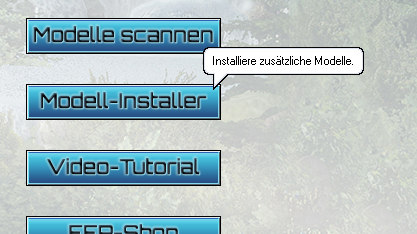
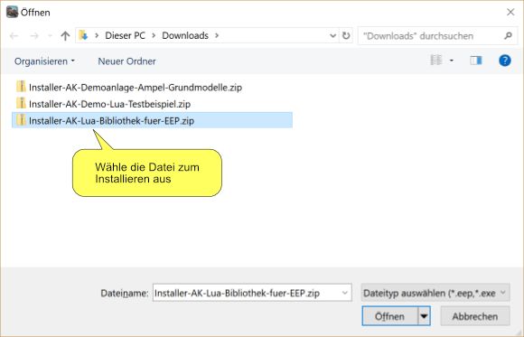
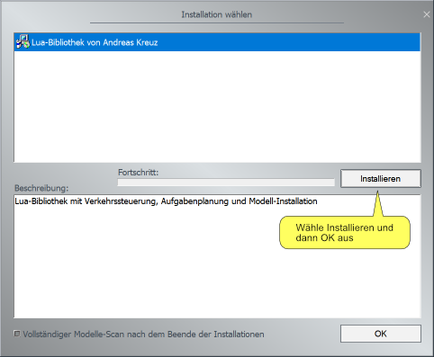

# Installieren der Control Extension

## Herunterladen

- Lade Dir die Datei [`control-extension-for-eep-*.zip`]({{ site.github.latest_release.assets[0].browser_download_url }}) herunter.

## Installieren

Öffne EEP und verwende den Modell-Installer, um die Control Extension zu installieren

- Klicke auf Modell-Installer

  

- Wähle die heruntergeladene Datei aus

  

- Starte die Installation

  

**Tipp:** Das Scannen nach neuen Modellen ist nicht notwendig, da die Bibliothek keine 3D-Modelle enthält.

## Geschafft 🍀

Du hast die Installation abgeschlossen.

Die Bibliothek wurde in das Unterverzeichnis `LUA\ce` Deiner EEP-Installation installiert, z.B. in `C:\Trend\EEP16\LUA\`.

Jetzt kannst Du:

- [EEP-Web einrichten](../anleitungen-installation/einrichten-von-eep-web)
- die [Anleitung für eine automatische Ampelkreuzung](../anleitungen-ampelkreuzung/ampelkreuzung) starten
- die [Dokumentation der Bibliothek](../lua/ce/) lesen.
