# Kreuzung per Assistent erstellen

<p class="lead">Diese Anleitung zeigt Dir, wie Du eine Kreuzung in der Web-App anlegst und den erzeugten Lua-Code in Deine Anlage übernimmst.</p>

**Voraussetzungen:**

- Die Control Extension ist installiert.
- Der Server und die Web-App laufen.
- Deine Anlage ist in EEP geöffnet und das Road-Modul ist in Lua eingebunden.
- Du weißt, welche Signal-IDs Deine sichtbaren Ampeln und Deine unsichtbaren Fahrspursignale haben.

⭐ **Tipp:** Wenn Du mit den Begriffen Kreuzung, Fahrspur, Ampelgruppe und Phase noch nicht vertraut bist, lies zuerst [Ampelkreuzung automatisch steuern](ampelkreuzung).

# Vorbereitung der Kreuzung

## Begriffe fürs Verständnis

Zunächst mal möchte ich euch noch die Begriffe nahelegen.

- **Zufahrt:** Als Zufahrt wird im Assistenten die Richtung beschrieben, aus der der Verkehr kommt. Also aus Süden, aus Norden, aus Westen usw.

- **Abbiegerichtung:** Jeder Verkehrsteilnehmer kann an der Kreuzung abbiegen. Die Ampel für seine Abbiegerichtung bestimmt, ob er das darf, indem sie diese Abbiegerichtung freigibt oder eben nicht.

  Eine normale Ampel ohne Richtungspfeile gilt im Normalfall für alle Richtungen. Sie gilt aber nicht für Linksabbieger, wenn gleichzeitig eine eigene Ampel mit Linkspfeil existiert.

- **Ampel:** Als Ampel werden alle Signale oder Immobilien in EEP bezeichnet, die anzeigen, welcher Verkehr fahren darf, bzw. welche Fußgänger laufen dürfen.

- **Ampelgruppen:** Manche Ampeln einer Zufahrt werden immer zusammen geschaltet, weil sie für dieselben Abbiegerichtungen gelten. Das heißt dann Ampelgruppe.

  Die folgende Zufahrt aus Osten hat zum Beispiel drei Ampelgruppen:
  - Linksabbieger
  - Tram geradeaus
  - Verkehr geradeaus

- **Fahrspursignal:** Die Steuerung des Verkehrs erfolgt mit einem so genannten Fahrspursignal. Damit unterschiedliche Ampelgruppen für eine Fahrspur möglich sind, kann die Steuerung in EEP nicht immer über die sichtbaren Ampeln erfolgen, sondern über ein unsichtbares Signal.

- **Phase:** Eine Ampelphase schaltet mehrere Ampelgruppen einer Kreuzung gleichzeitig und zwar so, dass keine Konflikte auftreten.

- **Fußgängerfurt** Das ist eine Querung für Fußgänger die durch zwei gegenüberliegende Fußgängerampeln gesichert wird.

## Veranschaulichung

Das folgende Bild veranschaulicht noch mal **Ampeln** und deren Zuordnung zu **Ampelgruppen**. An dieser Zufahrt aus Westen stehen drei Ampelgruppen für Straßenverkehr und eine für eine Fußgängerfurt - die beiden sich gegenüberliegenden Fußgängerampeln.

1. Zwei Ampeln für Tram geradeaus
2. Zwei Ampeln für linksabbiegenden Verkehr
3. Zwei Ampeln für Verkehr, der geradeaus fährt
4. Auch die beiden Fußgängerampeln bilden eine Ampelgruppe

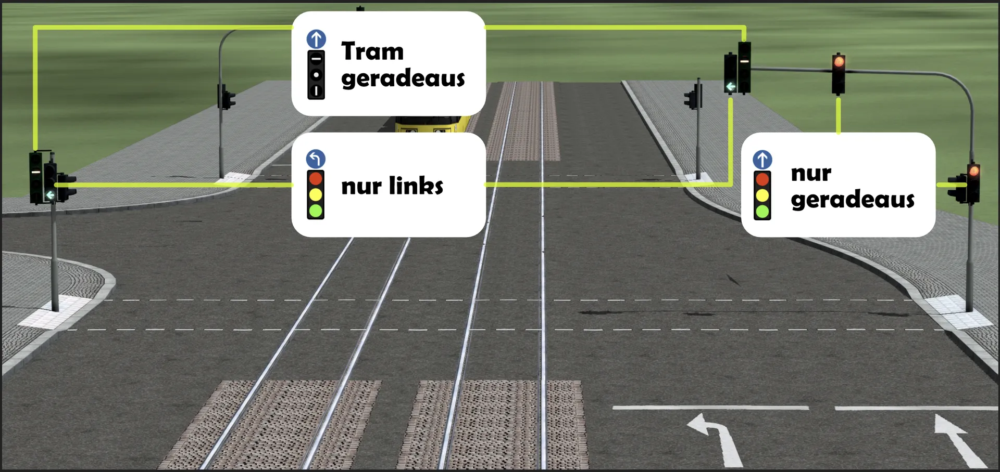

## Mein Umsetzungsvorschlag

Die eigentliche Fahrspur bekommt ein unsichtbares Fahrspursignal. Dieses Signal hält den Verkehr an oder lässt ihn fahren. (Darum heißt es nicht Fahrspurampel, sondern Fahrspursignal.)

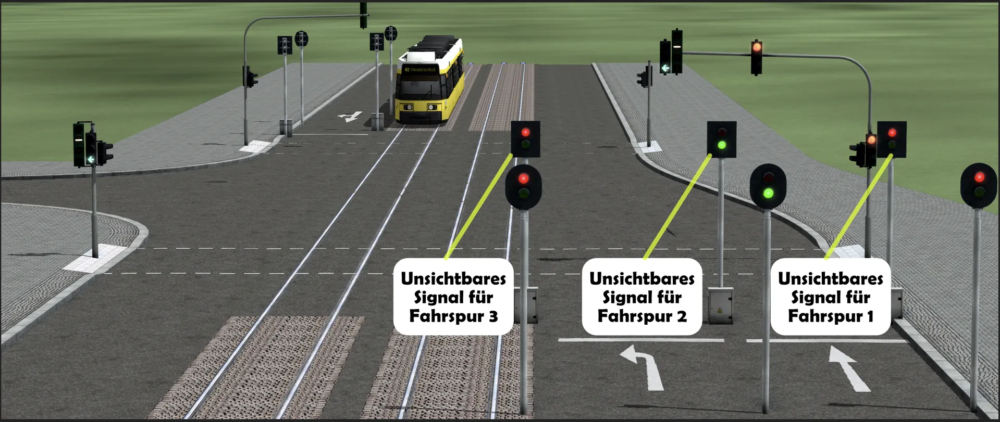

Warum machen wir das? Das klingt erst einmal umständlicher, macht die Kreuzung aber deutlich flexibler:

- Eine Fahrspur kann je nach Fahrtrichtung auf unterschiedliche Ampelgruppen reagieren.
- Rechtsabbiegerpfeile lassen sich zusätzlich zu normalen Ampeln schalten.
- Eine Tram auf derselben Spur kann andere Signalbilder bekommen als der Autoverkehr.
- Die sichtbaren Ampeln müssen nicht direkt den Verkehr in EEP steuern.

## Ampeln ohne Verkehrsbeeinflussung aufstellen

Alle Ampeln aus Ampelgruppen setze ich so, dass sie den Verkehr nicht beeinflussen. Im Einspursystem stelle ich sie zum Beispiel auf die Spur der Gegenfahrbahn und bewege sie dann mit dem Gizmo and die gewünschte Position. Da die dann auf der Gegenfahrbahn entgegen der Fahrtrichtung stehen, beeinflussen sie den Verkehr nicht.

Die folgende Ampel beeinflußt den Verkehr nicht, da sie auf der Gegenspur entgegen der Fahrrichtung aufgestellt ist (siehe rote Haltelinie - das funktioniert nur im Einspursystem!):

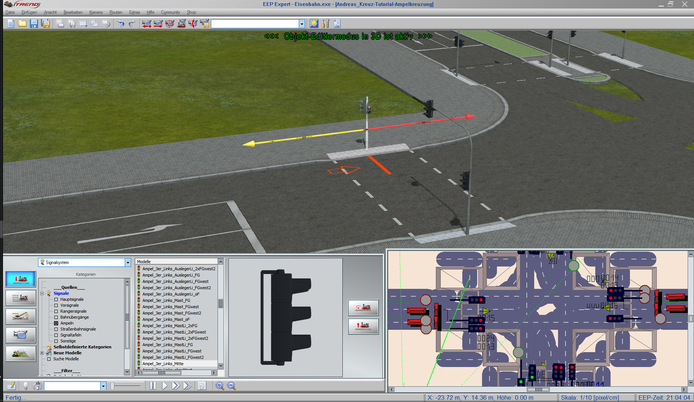

So werden alle Ampeln aus den Ampelgruppen im Einspursystem auf die Gegenseite gesetzt und dienen nur der Anzeige. Die Steuerung übernimmt einzig und allein das unsichtbare Fahrspursignal.

# Anlage vorbereiten

## Lua-Script einbinden

Damit ich losarbeiten kann, aktiviere ich die Control Extension und das Road-Modul in meiner Anlage.

Ich selbst arbeite gerne so, dass ich die Lua-Dateien im Lua-Verzeichnis meiner Installation anlege. Im folgenden Beispiel in: `LUA\ce\demo-anlagen\road-mod\Kreuzung1-main`:

In EEP selbst genügt im Lua-Editor:

```lua
clearlog()
require("ce.demo-anlagen.road-mod.Kreuzung1-main")
```

In der eingebundenen Datei steht dann der eigentliche Aufbau:

```lua
clearlog()

local Lane = require("ce.mods.road.Lane")
local PedestrianCrossing = require("ce.mods.road.PedestrianCrossing")
local Intersection = require("ce.mods.road.Intersection")
local TrafficLight = require("ce.mods.road.TrafficLight")
local TrafficLightModel = require("ce.mods.road.TrafficLightModel")

---------------------------------
-- Lade Funktionen fuer Ampeln
---------------------------------
local BetterContacts = require("ce.third-party.BetterContacts_BH2")
BetterContacts.setOptions({
    varname = "Zugname",
    varnameTrackID = "trackId"
})

---------------------------------------------
-- Definiere Funktionen fuer Kontaktpunkte
---------------------------------------------
function onLaneEntered(trainName, laneKpId)
    local lane = Lane.resolve(laneKpId)
    lane:vehicleEntered(trainName)
end

function onLaneLeft(trainName, laneKpId)
    local lane = Lane.resolve(laneKpId)
    lane:vehicleLeft(trainName)
end

---------------------------------------------
-- Lade die Control-Extension mit Optionen
---------------------------------------------
local ControlExtension = require("ce.ControlExtension")
    .setOptions({ anl3path = "Resourcen\\Anlagen\\ce\\road-mod\\Kreuzung1.anl3", })
    .addModules(require("ce.mods.road.CeRoadModule"))

--------------------------------------------------
-- ControlExtension.runTasks(1) muss in EEPMain
--------------------------------------------------
function EEPMain()
    ControlExtension.runTasks(1)
    return 1
end
```

In der Zeile `.setOptions({ anl3path = ... })` setze ich den Pfad zu meiner Anlage ein. Das ermöglicht der Control Extension das Einlesen der Anlagendatei. Dann sind die Eingaben im Wizard stark vereinfacht.

## Web-App installieren und starten

Wie die Web-App installiert und gestartet wird, ist in einem anderen Tutorial beschrieben.

## Schritte in der Web-App

Sobald ich im 3D-Editor meiner Anlage bin, sieht die Web-App unter **Ampeln** so aus:

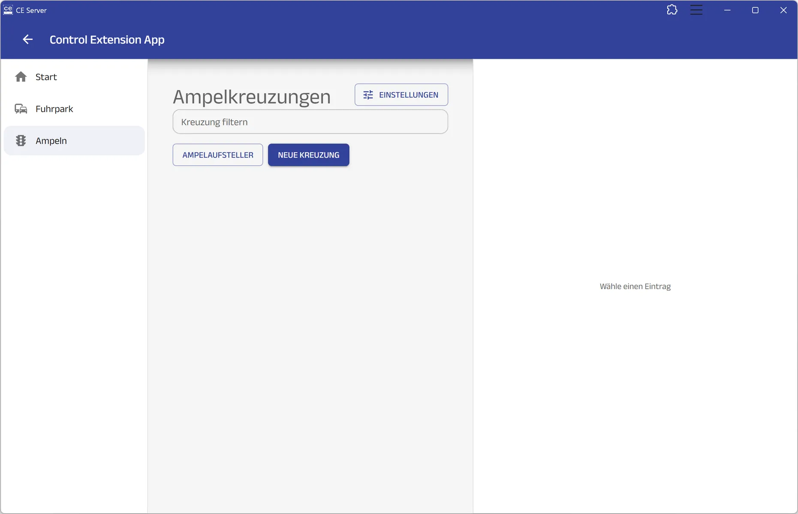

Ein Klick auf **Neue Kreuzung** bringt mich in den Assistenten. Wenn ich **Signal-IDs und Modellinformationen in EEP anzeigen** auf **Ja** stelle, dann sehe ich in EEP nach dem Klick auf **Neue Kreuzung erstellen** die Signal-IDs.

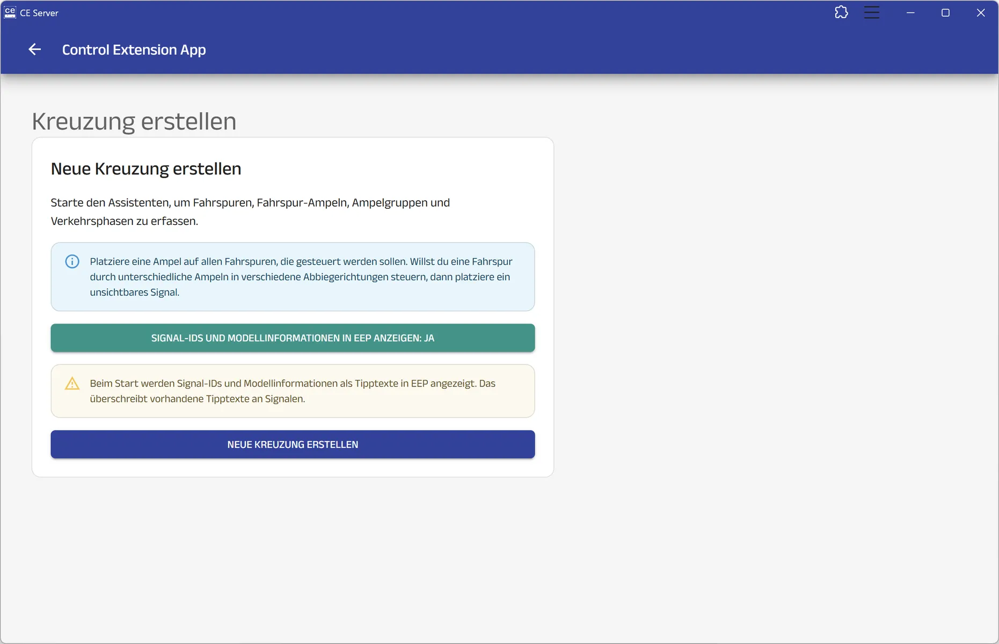

Gehen wir jetzt in EEP in den 3D-Modus, werden die IDs der Signale darüber angezeigt. Das erleichtert dann die Zuordnung dieser Signale, wenn wir gleich ihre IDs benötigen.

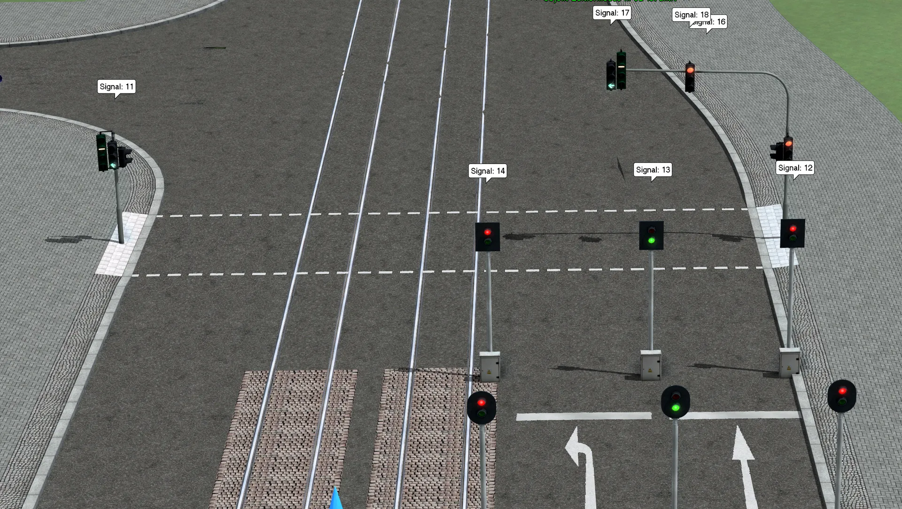

# Schritt 1: Kreuzungseinstellungen

- **Name:** Name der Kreuzung wähle ich mir einen eindeutigen Namen aus, wie zum Beispiel "Schillerplatz" oder "Bahnhofstrasse - Hauptstraße".

- **Speicherplatz in EEP** Ich wähle einen Speicherplatz in EEP. Dabei werden mir die ersten freien Speicherplätze zur Auswahl angeboten. Hier speichert die Control Extension Einstellungen mit `EEPSaveData(...)`.

- **Kameras der Kreuzung:** Im Feld für Kameras kann ich vorhandene Kameras auswählen oder eigene Namen eintippen.

- **Phasenanzeige-Immobilie:** Für die spätere Anzeige von Phasen als Tipp-Text gebe ich einen Fahrradständer an. Hier verwende ich den Lua-Namen aus einer Immobilie.

- **Fußgängerfurten verwenden:** Ich will Fußgängerfurten verwenden, also kommt dort ein Haken rein. Ihr könnt das auch später nachholen ist auch kein Problem.

- **Erweiterte Einstellungen:** Sind etwas für ein späteres Tutorial. Da kreuze ich erstmal nichts an, damit wir zuerst das Grundgerüst bauen können.

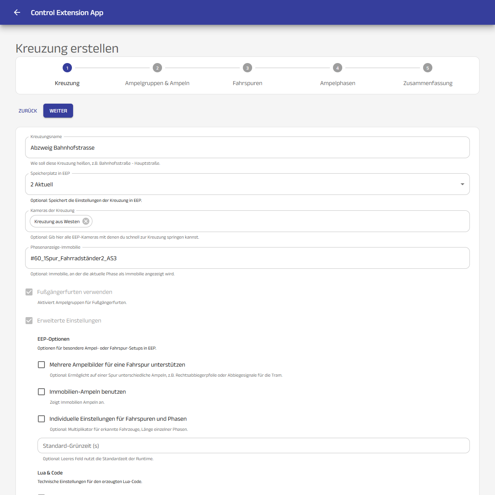

_Info_: Im Hintergrund bekommt die Kreuzung einen kurzen Variablennamen `c1`. Dieser wird immer geprüft und hochgezählt. Wenn eine Kreuzung über Lua bekannt ist, die schon den Namen `c1` hat, wird `c2` genommen, dann `c3` usw.

# Schritt 2: Ampeln und Ampelgruppen

An meinem Schritt 2 oben steht zunächst eine rote `1`. Das bedeutet: In diesem Schritt ist noch ein Fehler. In dem Fall lautet der Hinweis sinngemäß: Lege mindestens eine Ampelgruppe an.

Ich klicke auf **Ampelgruppe hinzufügen**.

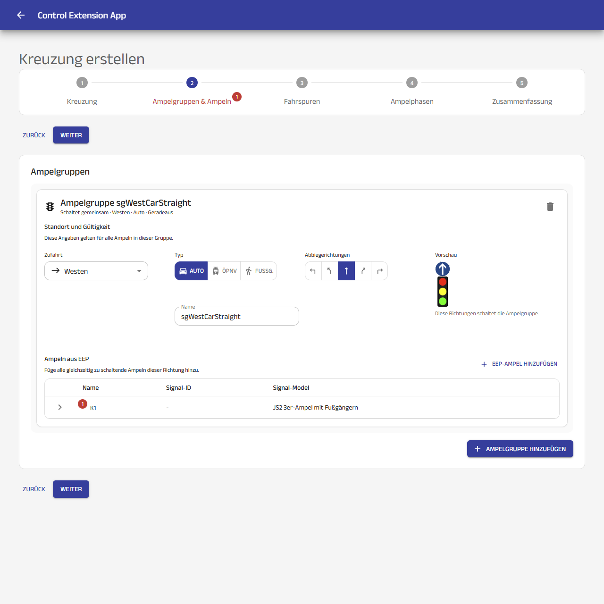

Was sehen wir hier?

- Ich kann zuerst die Zufahrtsrichtung angeben. Das setzt Variablennamen und hilft bei der Zuordnung und beim Verständnis der Kreuzung.
- Ampelgruppen können später nur Fahrspuren zugewiesen werden, wenn beide dieselbe Zufahrt haben.
- Außerdem sehe ich die Abbiegerichtungen, für die meine Ampelgruppe gelten soll.

Für meine Zufahrt aus Westen brauche ich vier Ampelgruppen:

- `K1` und `K2` für Geradeausfahrer
- `K3` und `K4` für Linksabbieger
- `S1` und `S2` für die Tram. Hier stelle ich den Typ mit dem **ÖPNV**-Schalter ein.
- `F1` und `F2` für die Fußgängerfurt

Ich beginne mit der ersten Konfiguration:

1. Meine Ampelgruppe gilt für Westen, Auto und Geradeaus. Sie hat zwei Ampeln.
2. Ich schaue mir die Signale in EEP an und sehe, dass meine sichtbaren Ampeln für geradeaus die Signal-IDs `16` und `18` haben.
3. Ich klappe die Ampel `K1` auf und trage dort die Signal-ID `16` und das Modell `JS2 3er-Ampel mit Fußgängern` ein.
4. Für `K2` trage ich die Signal-ID `18` und das Modell `JS2 3er-Ampel ohne Fußgänger` ein.

❗ **Wichtig:** Das unsichtbare Fahrspursignal trage ich hier nicht ein. In die Ampelgruppe kommen hier nur die sichtbaren Ampeln, die das Signalbild anzeigen sollen.

Woher weiß EEP jetzt, wie es die Ampel schalten soll? Dazu dient die Lua-Klasse `TrafficLightModel` aus der Control Extension. In dieser ist hinterlegt, welche Signalstellung rot, gelb, grün und gegebenenfalls Fußgänger zeigt.

Wenn ihr wie ich die Ampeln von JS2 nutzt (`V80NJS20039`), dann habt ihr es leicht. Schaut nach, ob eure Ampel eine Ampel mit Fußgängern ist oder ohne. Im Assistenten wählt ihr den lesbaren Namen:

- `JS2 3er-Ampel mit Fußgängern` für eine Ampel mit Fußgängersignal
- `JS2 3er-Ampel ohne Fußgänger` für eine reine Fahrzeugampel
- `Unsichtbares Signal` für ein unsichtbares Fahrspursignal

Im erzeugten Lua-Code stehen später trotzdem die Konstanten wie `TrafficLightModel.JS2_3er_mit_FG`. Das ist richtig so: Die Web-App zeigt den Namen, Lua verwendet die eindeutige Konstante.

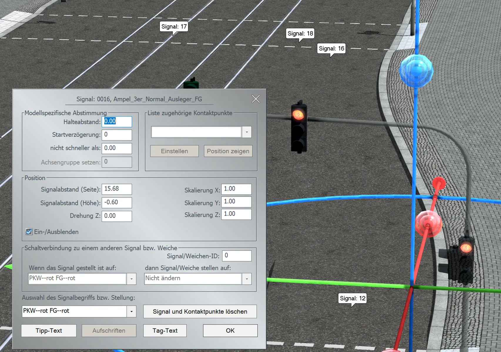

Damit habe ich meine erste Ampelgruppe fertig. Sie gilt für geradeaus aus Westen und schaltet zwei sichtbare Ampeln.

Die Zuweisung zu den Fahrspuren kommt erst später in Schritt 3. Die Zuordnung zu Phasen kommt in Schritt 4.

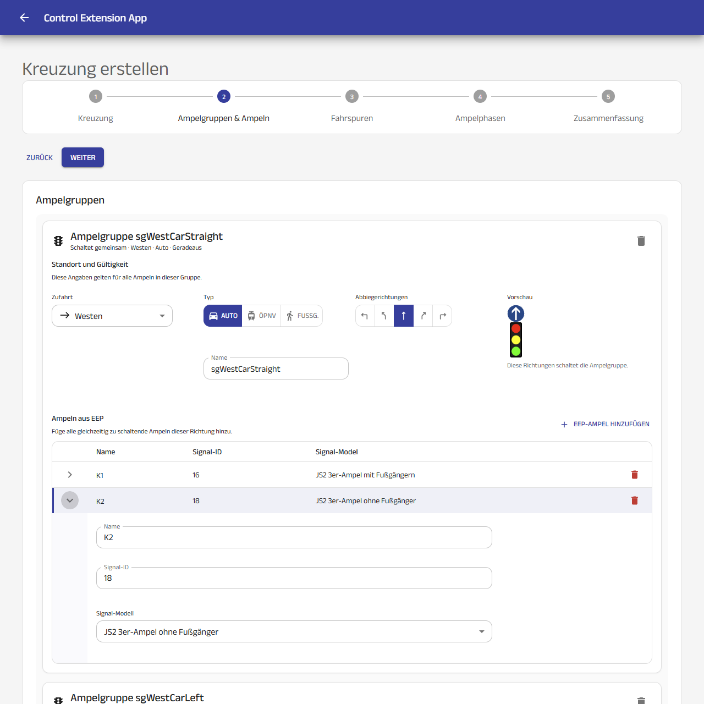

Das Ganze wiederhole ich jetzt, bis alle Ampelgruppen meiner Kreuzung fertig sind.

## Fußgängerfurten verwenden

Als letztes lege ich die Überquerung für die Fußgänger an.

Dazu klicke ich wieder auf **Ampelgruppe hinzufügen** und stelle die Ampelgruppe auf Fußgänger um.

Die EEP-Signale für meine Fußgänger-Ampel kann ich mit anderen Ampeln teilen. In diesem Beispiel entsprechen:

- `F1` = Fußgängersignal der Ampel `K2`
- `F2` = Fußgängersignal der Ampel `K4`

Das sieht dann so aus:

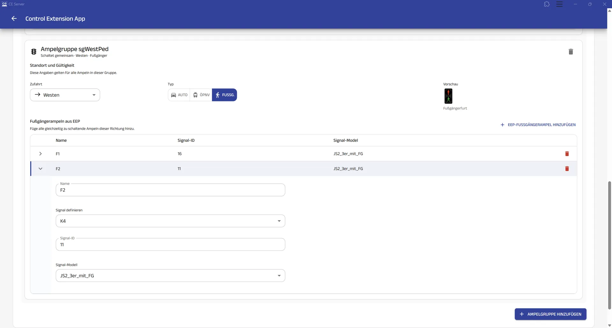

Sollte eine Zufahrt mehrere Furten haben, lege ich einfach mehrere an und weise ihnen die passenden Ampeln zu.

# Schritt 3: Fahrspuren anlegen

Jetzt geht es zu Schritt 3. Hier werden Fahrspuren angelegt und den Ampelgruppen zugewiesen.

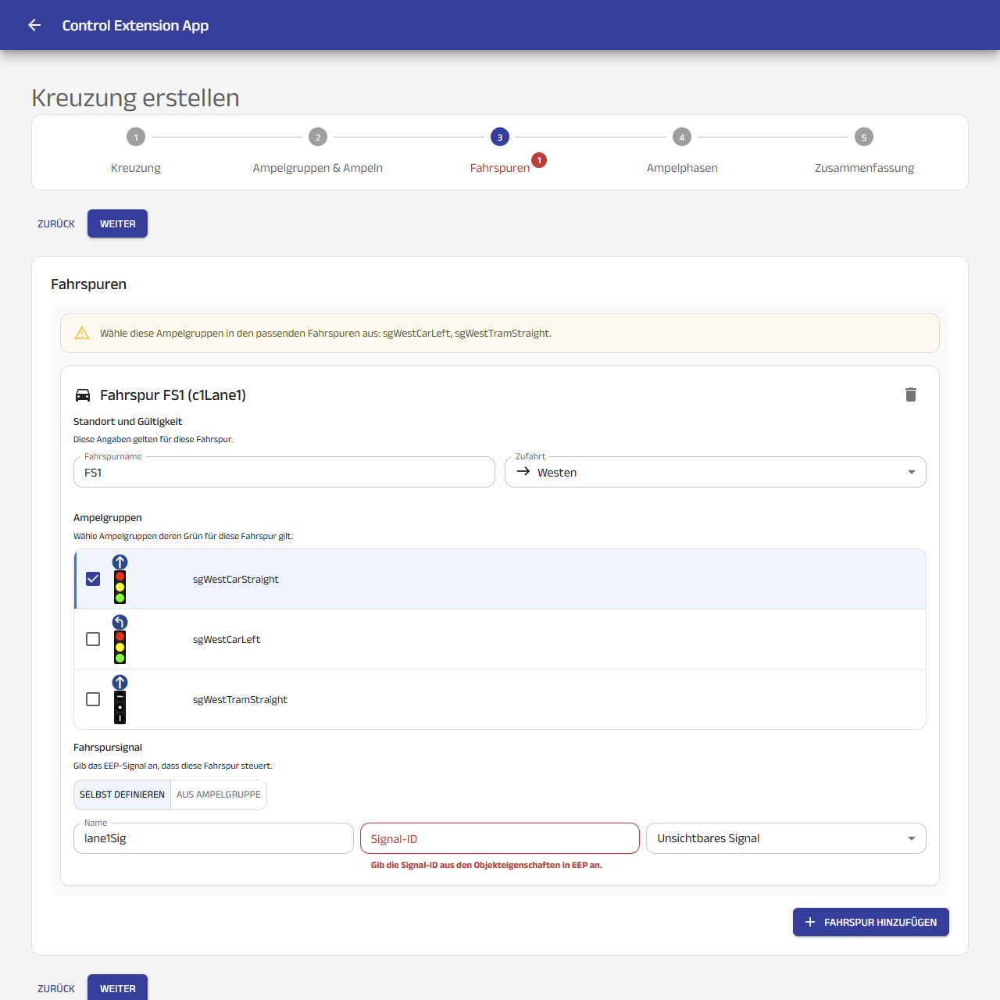

Ich wähle eine Ampelgruppe und wähle unten bei **Fahrspursignal** mein unsichtbares Signal.

Für diese Zufahrt lege ich drei Fahrspuren an:

- Für `FS1` die Signalgruppe `sgWestCarStraight`, da die Spur geradeaus geht. Gleichzeitig setze ich das Signal `12` als unsichtbares Fahrspursignal.
- Für `FS2` die Signalgruppe `sgWestCarLeft`, da die Spur links abbiegt. Gleichzeitig setze ich das Signal `13` als unsichtbares Fahrspursignal.
- Für `FS3` die Signalgruppe `sgWestTramStraight`, da hier die Tram geradeaus fährt. Gleichzeitig setze ich das Signal `14` als unsichtbares Fahrspursignal.

❗ **Wichtig:** Das Fahrspursignal ist das Signal, das den Verkehr in EEP wirklich anhält oder freigibt. Die sichtbaren Ampeln aus den Ampelgruppen zeigen nur das passende Bild.

Das sieht dann so aus:

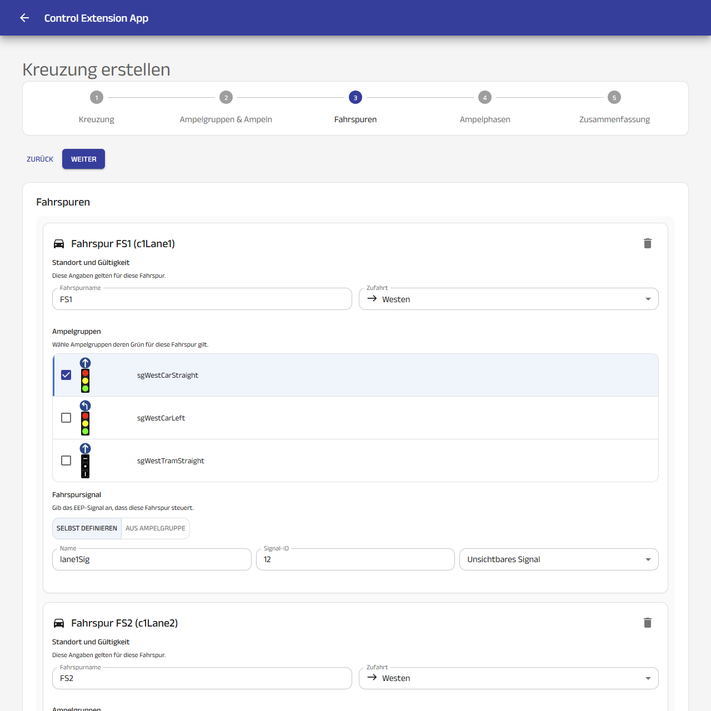

# Schritt 4: Phasen einrichten

Bin ich mit den Fahrspuren fertig, kann ich die Phasen einrichten.

Das ist eine Tabelle, in der ich auswähle, welche Ampelgruppen gleichzeitig grün bekommen sollen.

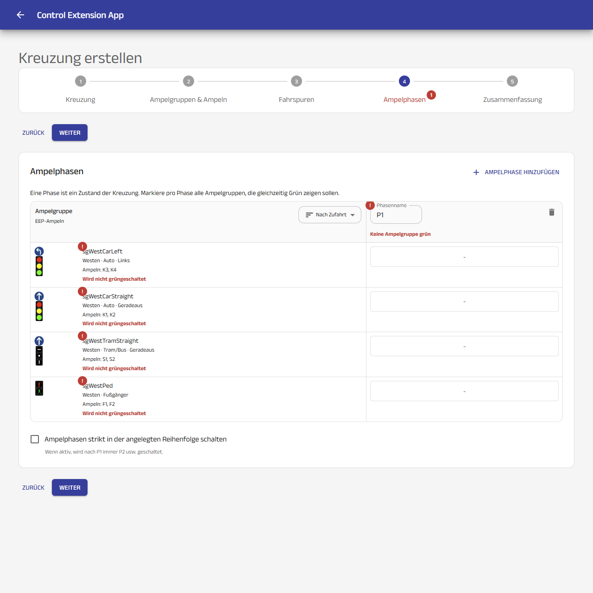

Ich habe zunächst nur die Phasen für die Zufahrt Westen eingerichtet:

- `P1`: erste Ampelgruppe und zweite Ampelgruppe
- `P2`: erste Ampelgruppe und dritte Ampelgruppe
- `P3`: vierte Ampelgruppe

Hier wähle ich aus, wer zusammen grün bekommen soll.

Die erste Ampelgruppe darf also entweder zusammen mit der zweiten oder zusammen mit der dritten Gruppe grün werden. Die vierte Gruppe läuft allein.

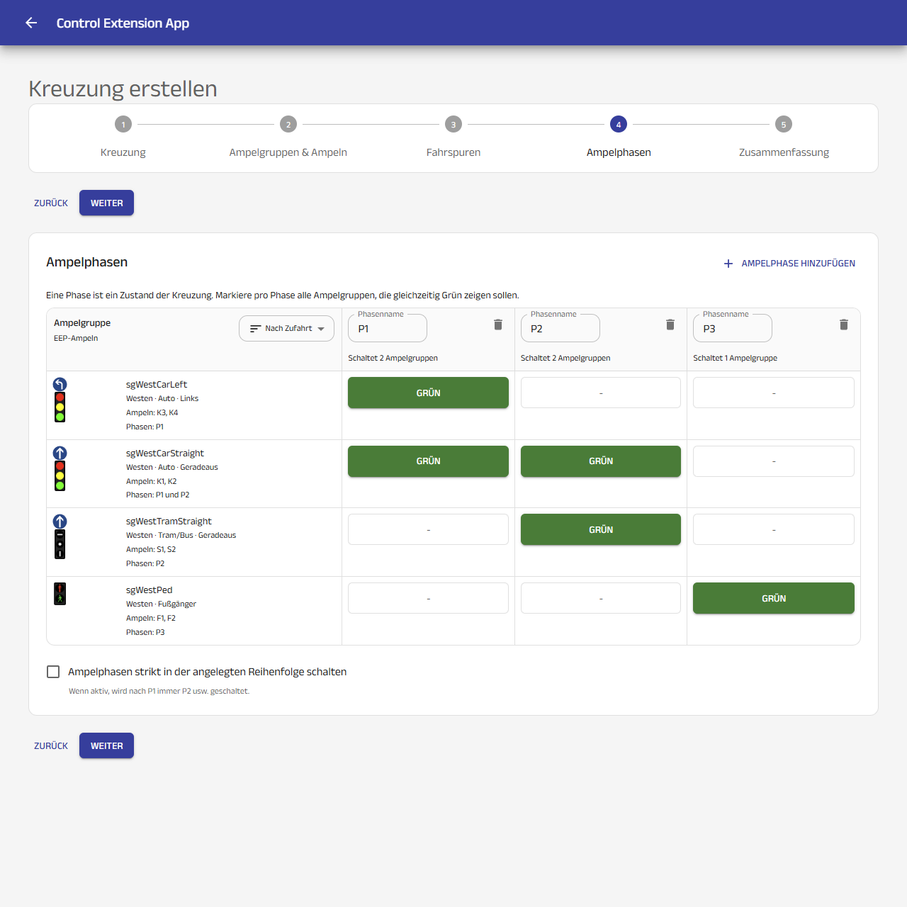

❗ **Beachte:** Eine Phase darf nur Ampelgruppen enthalten, die sich nicht gegenseitig kreuzen. Der Assistent kann Dir beim Aufbau helfen, aber die verkehrliche Logik Deiner Kreuzung musst Du selbst prüfen.

# Zusammenfassung und Lua-Code übernehmen

In der Zusammenfassung kann ich den Lua-Code kopieren, der dann in die Anlage kommt.

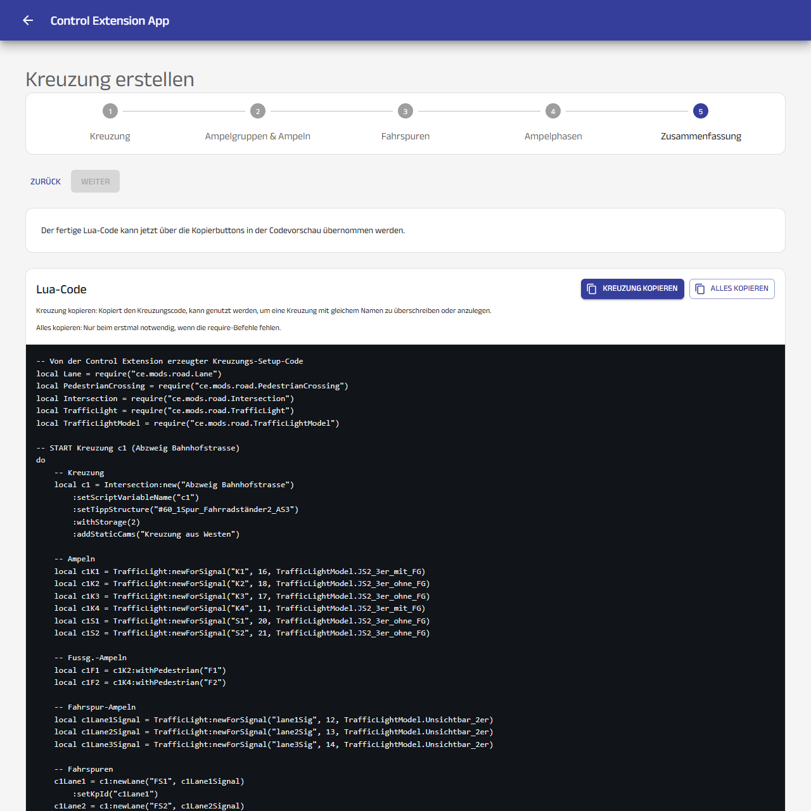

Wichtig, wenn Du den Code übernimmst:

- Der erste Teil vor `-- START Kreuzung ...` darf nur einmal in der Anlage stehen.
- Der Teil zwischen `-- START Kreuzung cX` und `-- END Kreuzung cX` gehört immer komplett zusammen.
- Genau das macht der Knopf **Kreuzung kopieren**.
- Es darf immer nur eine Kreuzung `c1` in Deiner Anlage geben, nur eine Kreuzung `c2` usw.

Der erzeugte Code ist im Grunde so aufgebaut:

```lua
-- Von der Control Extension erzeugter Kreuzungs-Setup-Code
local Lane = require("ce.mods.road.Lane")
local PedestrianCrossing = require("ce.mods.road.PedestrianCrossing")
local Intersection = require("ce.mods.road.Intersection")
local TrafficLight = require("ce.mods.road.TrafficLight")
local TrafficLightModel = require("ce.mods.road.TrafficLightModel")

-- START Kreuzung c1 (c1)
do
    local c1 = Intersection:new("c1")
        :setScriptVariableName("c1")
        :setTippStructure("#60_1Spur_Fahrradständer2_AS3")
        :withStorage(2)
        :addStaticCams("Kreuzung aus Westen")

    local c1K1 = TrafficLight:newForSignal("K1", 16, TrafficLightModel.JS2_3er_mit_FG)
    local c1K2 = TrafficLight:newForSignal("K2", 18, TrafficLightModel.JS2_3er_ohne_FG)
    local c1K3 = TrafficLight:newForSignal("K3", 17, TrafficLightModel.JS2_3er_ohne_FG)
    local c1K4 = TrafficLight:newForSignal("K4", 11, TrafficLightModel.JS2_3er_mit_FG)
    local c1S1 = TrafficLight:newForSignal("S1", 20, TrafficLightModel.JS2_3er_ohne_FG)
    local c1S2 = TrafficLight:newForSignal("S2", 21, TrafficLightModel.JS2_3er_ohne_FG)
    local c1F1 = c1K2:withPedestrian("F1")
    local c1F2 = c1K4:withPedestrian("F2")
    local c1Lane1Signal = TrafficLight:newForSignal("lane1Sig", 12, TrafficLightModel.Unsichtbar_2er)
    local c1Lane2Signal = TrafficLight:newForSignal("lane2Sig", 13, TrafficLightModel.Unsichtbar_2er)
    local c1Lane3Signal = TrafficLight:newForSignal("lane3Sig", 14, TrafficLightModel.Unsichtbar_2er)

    c1Lane1 = c1:newLane("FS1", c1Lane1Signal)
        :setKpId("c1Lane1")
    c1Lane2 = c1:newLane("FS2", c1Lane2Signal)
        :setKpId("c1Lane2")
    c1Lane3 = c1:newLane("FS3", c1Lane3Signal)
        :setKpId("c1Lane3")

    local c1SgWestCarStraight = c1
        :newSignalGroup("sgWestCarStraight")
        :setScriptVariableName("c1SgWestCarStraight")
        :setApproach(Lane.Approach.WEST)
        :setTurnDirections(Lane.Directions.STRAIGHT)
        :addVehicleSignals(c1K1, c1K2)
    local c1SgWestCarLeft = c1
        :newSignalGroup("sgWestCarLeft")
        :setScriptVariableName("c1SgWestCarLeft")
        :setApproach(Lane.Approach.WEST)
        :setTurnDirections(Lane.Directions.LEFT)
        :addVehicleSignals(c1K3, c1K4)
    local c1SgWestTramStraight = c1
        :newSignalGroup("sgWestTramStraight")
        :setScriptVariableName("c1SgWestTramStraight")
        :setApproach(Lane.Approach.WEST)
        :setTurnDirections(Lane.Directions.STRAIGHT)
        :addTramSignals(c1S1, c1S2)
    local c1SgWestPed = c1
        :newSignalGroup("sgWestPed")
        :setScriptVariableName("c1SgWestPed")
        :setApproach(Lane.Approach.WEST)
        :addPedestrianSignals(c1F1, c1F2)

    c1Lane1:driveOnDefaultSignalGroups(c1SgWestCarStraight)
    c1Lane2:driveOnDefaultSignalGroups(c1SgWestCarLeft)
    c1Lane3:driveOnDefaultSignalGroups(c1SgWestTramStraight)

    c1:newPhase("P1")
        :addSignalGroups(c1SgWestCarStraight, c1SgWestCarLeft)
    c1:newPhase("P2")
        :addSignalGroups(c1SgWestCarStraight, c1SgWestTramStraight)
    c1:newPhase("P3")
        :addSignalGroups(c1SgWestPed)
end
-- END Kreuzung c1 (c1)
```

⭐ **Tipp:** `:setKpId("c1Lane1")` registriert die Fahrspur unter dem Schlüssel, den später die Kontaktpunkte verwenden. Die Lua-Variable heißt zwar ebenfalls `c1Lane1`, aber für den Kontaktpunkt zählt der Text in `setKpId`.

# Kontaktpunkte für Fahrspuren

Wenn der Assistent mehrere Ampelbilder für eine Spur unterstützen soll oder wenn Anforderungen gezählt werden sollen, brauche ich Kontaktpunkte.

Der erste Kontaktpunkt liegt vor der Ampel und meldet, dass ein Fahrzeug die Fahrspur betreten hat:

```lua
onLaneEntered(Zugname, "c1Lane1")
```

Der zweite Kontaktpunkt liegt hinter der Ampel und meldet, dass ein Fahrzeug die Fahrspur verlassen hat:

```lua
onLaneLeft(Zugname, "c1Lane1")
```

Die Funktionen selbst lösen den Namen der Fahrspur auf und melden den Zug an der richtigen Fahrspur an oder ab:

```lua
function onLaneEntered(trainName, laneKpId)
    local lane = Lane.resolve(laneKpId)
    lane:vehicleEntered(trainName)
end

function onLaneLeft(trainName, laneKpId)
    local lane = Lane.resolve(laneKpId)
    lane:vehicleLeft(trainName)
end
```

Damit das funktioniert, muss die Fahrspur im erzeugten Code einen passenden Namen bekommen:

```lua
c1Lane1 = c1:newLane("FS1", c1Lane1Signal)
    :setKpId("c1Lane1")
```

❗ **Beachte:** Verwende im Kontaktpunkt den Text `"c1Lane1"` und nicht die Lua-Variable `c1Lane1`. Der Kontaktpunkt übergibt nur den Schlüssel. `Lane.resolve(...)` sucht daraus die richtige Fahrspur.

# Was der Assistent erzeugt

Der Assistent nimmt Dir nicht die Planung der Kreuzung ab. Er erzeugt Dir aber den wiederholbaren Lua-Code für das Hinterlegen:

- der Kreuzung selbst,
- deren Ampeln und Ampelgruppen inklusive Fußgängerfurten,
- Fahrspuren und deren Ansteuerung
- die Zuordnung von Ampelgruppen zu Fahrspuren den automatischen Ablauf der Phasen.

Wenn später etwas nicht funktioniert, prüfe ich zuerst genau diese Reihenfolge:

1. Haben alle sichtbaren Ampeln die richtige Signal-ID und das richtige `TrafficLightModel`?
2. Haben die Fahrspuren eigene unsichtbare Fahrspursignale?
3. Passen Zufahrt und Abbiegerichtung von Fahrspur und Ampelgruppe zusammen?
4. Sind die Phasen so angelegt, dass der Verkehr sich nicht in die Quere kommt?
5. Rufen die Kontaktpunkte `onLaneEntered(...)` und `onLaneLeft(...)` mit dem richtigen Fahrspur-Schlüssel auf?
