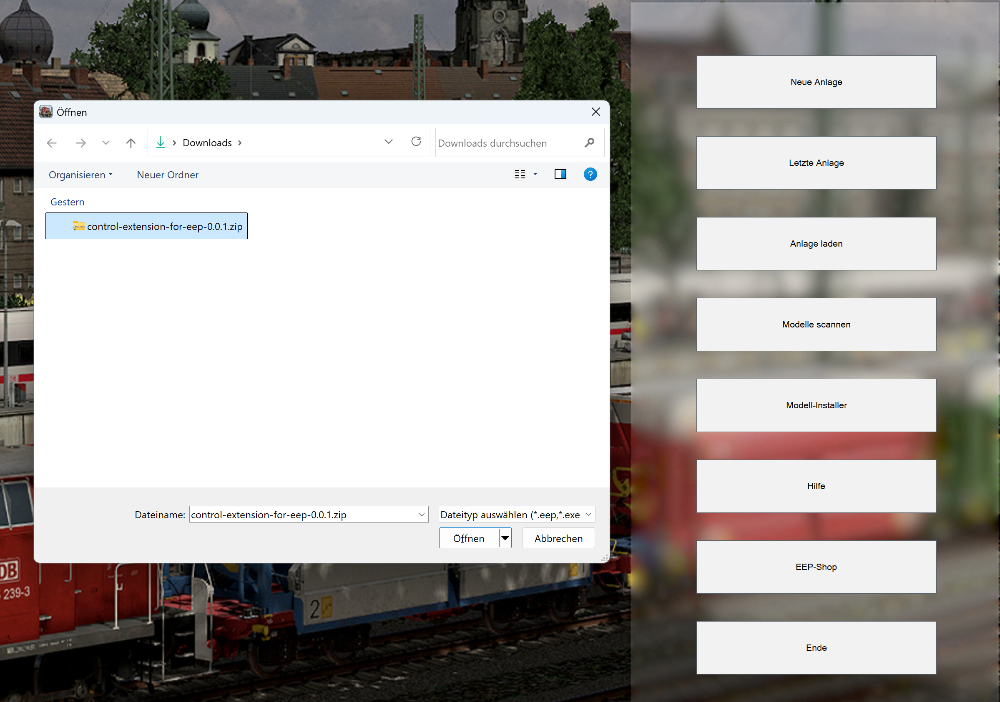

# Überblick

In dieser Anleitung

1. Lädst du den Installer für die Control Extension herunter
2. Installierst du die Control Extension in EEP
3. Startest du den Server und wählst das EEP-Verzeichnis aus

## 1. Herunterladen

Du findest die aktuelle Version unter Releases auf der GitHub-Seite.
Gehe auf die Seite mit der neuesten Version [Latest Release](https://github.com/Andreas-Kreuz/control-extension/releases/latest).

Auf dieser Seite lädst du unter **Assets** die ZIP-Datei mit dem Installer für EEP:\
`control-extension-for-eep-(VERSION)-installer.zip`

## 2. In EEP installieren

Öffne EEP und verwende den Modell-Installer, um die Control Extension zu installieren.

1. Klicke auf Modell-Installer

2. Wähle die heruntergeladene Datei aus

   

3. Starte die Installation

**:bulb: Tipp:** Das Scannen nach neuen Modellen ist nicht notwendig, da die Bibliothek keine 3D-Modelle enthält.

**:bulb: Tipp:** Wenn Du bereits eine alte Version der Control-Extension installiert hast, kann es sinnvoll sein, die alten Dateien vor der Installation zu entfernen: Lösche die beiden `ce`-Verzeichnisse `LUA/ce` und `Ressourcen/Anlagen/ce` in deinem EEP-Ordner.

## 3. Server einrichten

Nach der Installation findest Du die Server-Anwendung in Deiner EEP-Installation.

1. Starte `control-extension-server.exe` aus dem Verzeichnis `LUA\ce`.

   Beispiel: `C:\Trend\EEP18\LUA\ce\control-extension-server.exe`

   

2. Falls der Server Deine EEP-Installation nicht automatisch findet, wähle das passende EEP-Verzeichnis im Server-Fenster aus.

   

3. Ist das Verzeichnis korrekt gewählt, dann kann der Server Daten empfangen
   - Wurde bereits eine Anlage genutzt, die mit der Control Extension läuft, dann werden deren Daten angezeigt:
     

   - Wenn noch keine Anlage mit Control Extension im Lua Code gestartet wurde, dann erscheint ein Hinweis, dass du noch die Control-Extension in Lua einbinden musst:
     

## Geschafft

Die Control Extension ist jetzt installiert und der Server ist vorbereitet.

Als Nächstes kannst Du:

- die [Demo-Anlage mit Web App nutzen](../anleitungen-installation/use-demo)
- die Control Extension in [eigene Anlagen einbinden](../anleitungen-installation/use-own-scenario-01)
- die [Lua-Dokumentation](../lua/LUA/ce/) lesen
