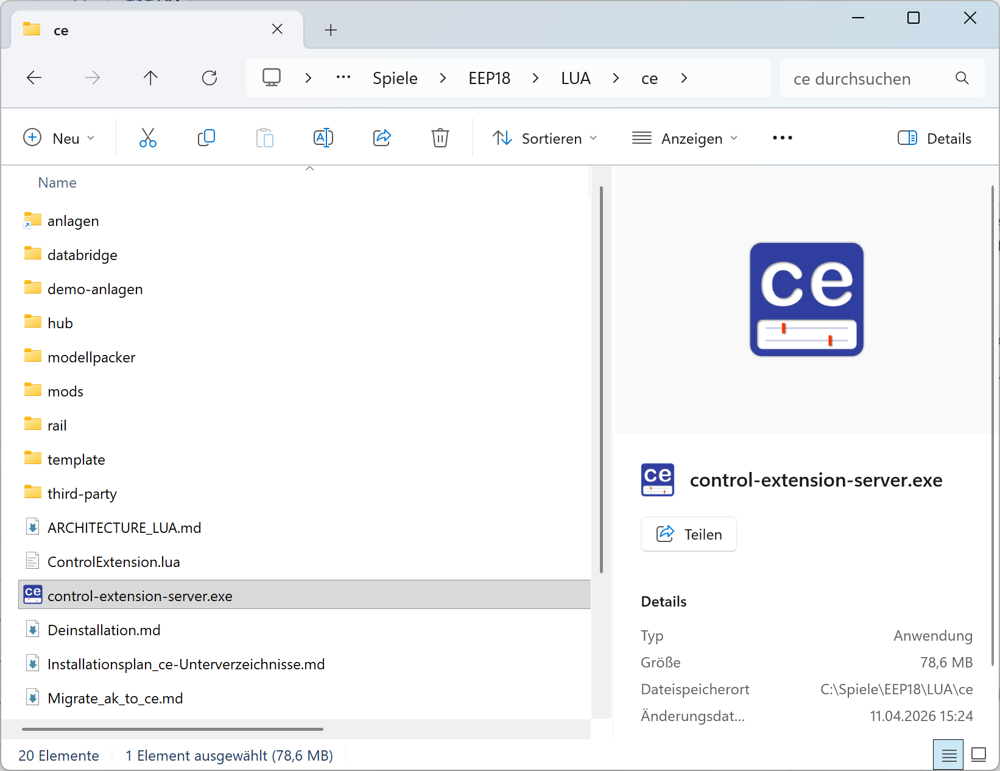

# Grundprinzip

- EEP schreibt Daten via Lua in das Verzeichnis `LUA\ce\databridge\exchange`
- Der Control Extension Server liest diese Daten und stellt sie für die Control Extension Web App bereit

## Vorbereitung in Lua

1. **Du brauchst für Lua**

   Eine aktuelle Version der Control Extension - mindestens Version 0.9.0 ([siehe Installation](../anleitungen-installation/installation))

2. **Lua einrichten**

   Wenn Du die Bibliothek installiert hast, dann nimm den Aufruf von `ControlExtension.runTasks()` in die vorhandene Funtion `EEPMain()` auf:

   ```lua
   local ControlExtension = require("ce.ControlExtension")
   ControlExtension.addModules(
       require("ce.hub.CeHubModule"),
       require("ce.mods.road.CeRoadModule")
   )

   function EEPMain()
       -- Dein bisheriger Code in EEPMain
       ControlExtension.runTasks()
       return 1
   end
   ```

3. **Einrichtung in Lua prüfen**

   Prüfe in der EEP-Installation, ob die Datei `LUA\ce\databridge\exchange\events-from-ce` geschrieben wird.

   _Hinweis_: Diese Datei wird angelegt wenn die Anlage im 3D-Modus läuft.

## Starten des Control Extension Servers

1. Starte die exe aus `C:\Trend\EEP16\LUA\ce\control-extension-server.exe`.

   

2. Falls der Control Extension Server das Programm nicht findet, wähle das Verzeichnis Deiner EEP-Installation:

   

3. So sollte es aussehen, wenn der Control Extension Server das Verzeichnis findet:

   

   🍀 Du hast es bis hierhin geschafft, nun wünsche ich viel Spaß beim Benutzen von `http://localhost:3000`.

   ⭐ Wenn Du den Control Extension Server von einem anderen PC erreichen möchtest, benutze statt `localhost` Deine IP-Addresse
   z.B. `http://192.168.0.99:3000` oder Deinen Rechnernmamen, z.B. `http://deinrechnername:3000`.
